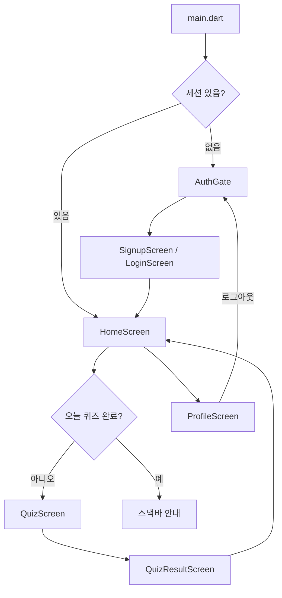

# hamfinz (햄핀즈)

매일 5분, 재미있게 배우는 금융 퀴즈 Flutter 앱입니다.  
OX·4지선다 퀴즈, XP/레벨, 연속 학습(streak), 햄스터 컬렉션 등 게이미피케이션 요소를 포함합니다.

## 기술 스택

| 구분        | 내용                       |
| ----------- | -------------------------- |
| 프레임워크  | Flutter (Dart SDK ^3.12.2) |
| 로컬 저장   | `shared_preferences`       |
| 백엔드      | 없음 (로컬 전용 MVP)       |
| 지원 플랫폼 | Android, iOS, Web, Windows |

## 프로젝트 구조

```
hamfinz/
├── lib/
│   ├── main.dart                 # 앱 진입점, 인증 상태에 따른 화면 분기
│   ├── data/
│   │   ├── quiz_data.dart        # 퀴즈 문제 목록, 일일 출제 로직
│   │   └── hamster_data.dart     # 햄스터 컬렉션 정의
│   ├── models/
│   │   ├── quiz_question.dart    # 퀴즈/답변/세션 결과 모델
│   │   └── user_profile.dart     # 사용자 프로필, 레벨, 학습 기록 모델
│   ├── services/
│   │   ├── storage_service.dart  # SharedPreferences 래퍼
│   │   ├── auth_service.dart     # 회원가입·로그인·세션·프로필 저장
│   │   └── quiz_service.dart     # 퀴즈 완료 처리, XP·streak·해금
│   ├── screens/
│   │   ├── auth/
│   │   │   ├── auth_gate.dart    # 랜딩 + 세션 확인
│   │   │   ├── login_screen.dart
│   │   │   └── signup_screen.dart
│   │   ├── home/
│   │   │   └── home_screen.dart  # 메인 대시보드
│   │   ├── quiz/
│   │   │   ├── quiz_screen.dart  # 퀴즈 진행
│   │   │   └── quiz_result_screen.dart
│   │   └── profile/
│   │       └── profile_screen.dart
│   ├── widgets/
│   │   ├── hamster_avatar.dart
│   │   ├── streak_badge.dart
│   │   └── xp_progress_bar.dart
│   ├── theme/
│   │   └── app_theme.dart
│   └── utils/
│       └── date_helper.dart      # 날짜 키, 오늘/어제 판별
├── test/
│   └── widget_test.dart
├── android/ · ios/ · web/ · windows/   # 플랫폼별 설정
└── pubspec.yaml
```

## 앱 흐름



1. `StorageService` 초기화 후 앱 실행
2. `AuthGate`에서 저장된 세션 확인 → 있으면 홈, 없으면 로그인/회원가입
3. 홈에서 오늘의 퀴즈 시작 → 문제 풀이 → 결과 화면 → 홈 복귀
4. 프로필에서 햄스터 선택, 학습 기록 확인, 로그아웃

## 주요 로직

### 1. 인증 (`AuthService`)

- **저장 키**
  - `finquiz_users`: 이메일별 사용자 데이터 (비밀번호, 닉네임, 프로필)
  - `finquiz_session`: 현재 로그인 이메일
- **회원가입**: 이메일 중복 검사, 비밀번호 6자 이상, 닉네임 필수
- **로그인**: 미가입 이메일이면 자동 가입 후 세션 생성 (데모용 동작)
- **로그아웃**: 세션 키만 삭제

> 현재 비밀번호는 평문으로 로컬에 저장됩니다. 프로덕션 전환 시 서버 인증 및 암호화가 필요합니다.

### 2. 퀴즈 (`QuizService` + `QuizData`)

| 항목         | 값                                           |
| ------------ | -------------------------------------------- |
| 전체 문제 수 | 12문항 (`allQuestions`)                      |
| 일일 출제 수 | 7문항 (`dailyQuestionCount`)                 |
| 정답 XP      | +10                                          |
| 오답 XP      | +2                                           |
| 문제 유형    | OX, 4지선다                                  |
| 카테고리     | 용돈 관리, 저축, 주식 기초, 보험, 세금, 신용 |

**일일 출제 알고리즘** (`QuizData.dailyQuestions`):

- `(날짜.day + 날짜.month * 31)`을 시드로 사용
- 문제 ID 해시 + 시드 기준 정렬 후 상위 7문항 선택
- 같은 날에는 동일한 문제 세트가 출제됨

**퀴즈 진행** (`QuizScreen`):

1. 답 선택 → 정오답 표시 + 해설 노출
2. 다음 문제 또는 결과 화면 이동
3. 세션 종료 시 `QuizService.completeSession()` 호출

**세션 완료 처리**:

- XP 누적, 카테고리별 정답률 갱신
- 학습 기록(`LearningRecord`) 추가
- 당일 첫 완료 시 streak 갱신 (어제 완료 → +1, 그 외 → 1로 리셋)
- 조건 충족 시 햄스터 해금
- `AuthService.saveProfile()`로 저장

### 3. 게이미피케이션 (`UserProfile`)

**레벨 시스템** (`LevelUtils`):

- 100 XP당 1레벨, 최대 Lv.10
- 레벨별 칭호: 금융 새싹 → … → 금융 고수

**Streak (연속 학습)**:

- 오늘 퀴즈를 처음 완료할 때만 카운트
- 어제 완료했으면 +1, 그렇지 않으면 1로 재시작
- 마지막 완료일이 어제·오늘 모두 아니면 streak 0으로 초기화 (`AuthService._profileFromJson`)

**햄스터 해금 조건** (`QuizService._unlockItems`):

| ID               | 조건             |
| ---------------- | ---------------- |
| `hamster_basic`  | 회원가입 시 기본 |
| `hamster_study`  | 첫 퀴즈 완료     |
| `hamster_streak` | 3일 연속 학습    |
| `hamster_level3` | 레벨 3           |
| `hamster_level5` | 레벨 5           |
| `hamster_master` | 레벨 10          |

### 4. 데이터 저장 (`StorageService`)

`SharedPreferences`에 JSON 문자열로 저장합니다.

```json
{
  "finquiz_users": {
    "user@example.com": {
      "password": "...",
      "nickname": "닉네임",
      "profile": {
        "xp": 0,
        "streak": 0,
        "lastQuizCompletedDate": "2026-07-21",
        "todayQuizCompleted": false,
        "unlockedHamsterIds": ["hamster_basic"],
        "selectedHamsterId": "hamster_basic",
        "learningHistory": [],
        "categoryStats": {}
      }
    }
  },
  "finquiz_session": "user@example.com"
}
```

## 화면별 역할

| 화면     | 파일                      | 설명                                                  |
| -------- | ------------------------- | ----------------------------------------------------- |
| 랜딩     | `auth_gate.dart`          | 앱 소개, 회원가입/로그인 진입, 자동 로그인            |
| 회원가입 | `signup_screen.dart`      | 닉네임·이메일·비밀번호 입력                           |
| 로그인   | `login_screen.dart`       | 이메일·비밀번호 입력                                  |
| 홈       | `home_screen.dart`        | 프로필 요약, XP/streak, 오늘의 퀴즈 시작              |
| 퀴즈     | `quiz_screen.dart`        | 문제 출제, 정답 처리, 해설 표시                       |
| 결과     | `quiz_result_screen.dart` | 정답 수, XP, 레벨업, 햄스터 해금 안내                 |
| 프로필   | `profile_screen.dart`     | 햄스터 컬렉션, 학습 기록, 카테고리별 정답률, 로그아웃 |

## 실행 방법

```bash
flutter pub get
flutter run
```

Chrome / Windows / Android 등 원하는 디바이스에서 실행할 수 있습니다.  
VS Code/Cursor에서는 `.vscode/launch.json` 설정을 사용할 수 있습니다.

## 개발 메모

- 회원 관리: 인증 / 로그인 / 회원가입 (로컬 MVP 완료)
- 퀴즈 기능: 문제 출제, 정답 처리, 해설 로직 (완료)
- 향후: 기능 명세서·API 명세서를 매니패스트로 정리, 서버 연동
