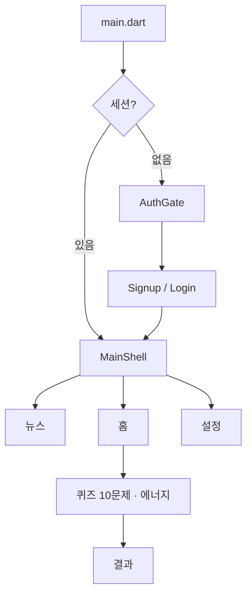

# hamfinz (햄핀즈)

매일 재미있게 배우는 금융 퀴즈 Flutter 앱입니다.  
OX·4지선다 퀴즈, 에너지 기반 학습, XP/레벨, streak, 햄스터 컬렉션, 뉴스 탭을 포함합니다.

> **상세 문서는 [`docs/`](./docs/README.md)를 보세요.**  
> 루트 README의 일부 설명은 예전 기준일 수 있습니다. 현재 동작·규칙은 docs가 우선입니다.

## 빠른 링크

| 문서 | 내용 |
|------|------|
| [docs/README.md](./docs/README.md) | 문서 인덱스 |
| [docs/architecture.md](./docs/architecture.md) | 아키텍처 |
| [docs/features.md](./docs/features.md) | 기능 명세 |
| [docs/quiz-energy.md](./docs/quiz-energy.md) | 퀴즈·에너지 |
| [docs/development-guide.md](./docs/development-guide.md) | 실행·테스트 계정 |

## 기술 스택

| 구분 | 내용 |
|------|------|
| 프레임워크 | Flutter (Dart SDK ^3.12.2) |
| 로컬 저장 | `shared_preferences` |
| 백엔드 | 없음 (로컬 MVP) |
| 지원 플랫폼 | Android, iOS, Web, Windows |

## 실행

```bash
flutter pub get
flutter run
```

테스트 계정: `test@finquiz.com` / `test1234`

웹에서 뉴스:

```bash
dart run tool/cors_proxy.dart
flutter run -d chrome --dart-define=NEWS_PROXY=http://localhost:8766
```

## 앱 흐름 (요약)



## 개발 메모

- 인증·퀴즈·에너지·뉴스 RSS·설정·약관 동의: 로컬 MVP 반영
- 예정: 뉴스 기사 LLM 퀴즈, 소셜 로그인, 서버 연동 — [docs/roadmap.md](./docs/roadmap.md)
