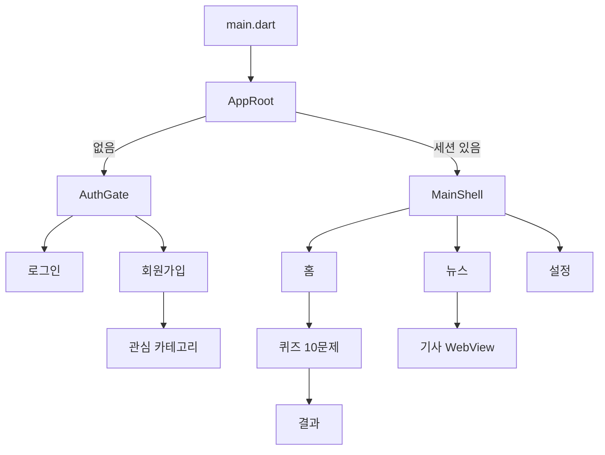

# hamfinz 문서

햄핀즈 Flutter 앱 기술·제품 문서 모음입니다.

## 문서 목록

| 문서 | 설명 |
|------|------|
| [architecture.md](./architecture.md) | 전체 아키텍처, 진입점, 레이어 구조 |
| [features.md](./features.md) | 제품 기능 명세 (현재 구현 기준) |
| [screens-and-navigation.md](./screens-and-navigation.md) | 화면·탭·네비게이션 흐름 |
| [auth.md](./auth.md) | 인증, 약관 동의, 관심 카테고리 |
| [quiz-energy.md](./quiz-energy.md) | 퀴즈 세션, 에너지, 연속 학습, 씨앗 보상 |
| [shop-seeds.md](./shop-seeds.md) | 씨앗(seed) 상점 화폐, 아이템·방어권·에너지 구매 설계 (초안) |
| [quiz-session-api.md](./quiz-session-api.md) | 세션 출제·제출 API (startSession · Firestore) |
| [quiz-production-deployment.md](./quiz-production-deployment.md) | 퀴즈 Functions 프로덕션 배포 체크리스트 |
| [news.md](./news.md) | 뉴스 탭, RSS, 기사 WebView |
| [data-models.md](./data-models.md) | 모델, 저장소 키, JSON 스키마 |
| [database/](./database/) | Firestore 스키마, 협업 가이드, 초안 |
| [status/](./status/) | 기능별 작업 상태 — 브랜치·PR·배포 여부·남은 일 (진행 중일 때만, 스키마 내용은 없음) |
| [development-guide.md](./development-guide.md) | 실행, 테스트 계정, CORS 프록시, 테스트 |
| [roadmap.md](./roadmap.md) | 미구현·예정 기능 |
| [figma-to-code.md](./figma-to-code.md) | Figma → Flutter 변환 규칙 |

## 한눈에 보기

- **패키지명:** `testapp` (`pubspec.yaml`)
- **앱 타이틀:** 햄핀즈
- **백엔드 예정:** Cloud Firestore + Firebase Auth ([database/](./database/))
- **플랫폼:** Android, iOS, Web, Windows
