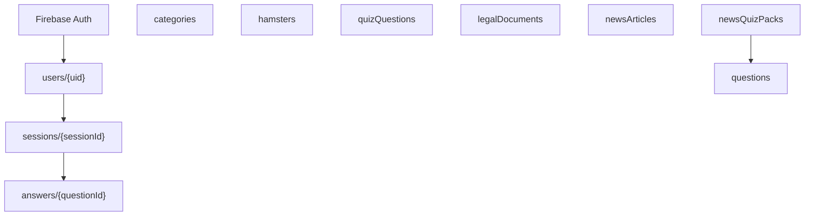

# Firestore 스키마 (임시 초안)

백엔드는 **Cloud Firestore + Firebase Authentication**을 전제로 한다.  
현재 앱의 SharedPreferences 구조를 컬렉션/문서로 옮긴 초안이다.

> 확정 전. 필드명·서브컬렉션 깊이는 구현하면서 바꿀 수 있다.

관련: [data-models.md](../data-models.md), [quiz-energy.md](../quiz-energy.md), [roadmap.md](../roadmap.md)

---

## 스택

| 구성 | 역할 |
|------|------|
| **Firebase Auth** | 이메일/비번, 이후 Google·Apple·Kakao |
| **Cloud Firestore** | 프로필, 퀴즈, 뉴스 캐시, 학습 기록 |
| **Cloud Functions** (권장) | 에너지 차감·세션 완료를 트랜잭션으로, 뉴스 LLM 생성 |
| **클라이언트 직접 쓰기** | 관심 카테고리 정도만. XP·에너지는 Functions 권장 |

비밀번호 해시(`passwordHash`/`salt`)는 Firestore에 **넣지 않는다**. Auth가 담당한다.

로컬 키 `finquiz_users` / `finquiz_session` → Auth UID + `users/{uid}`.

---

## 설계 원칙

| 원칙 | Firestore에서 |
|------|----------------|
| 앱 규칙 유지 | 에너지 100, 문제당 −10, 세션 7문제, XP 10/2 |
| 레벨은 저장하지 않음 | `xp`만. 레벨 = `min(xp ~/ 100 + 1, 10)` |
| 작은 목록은 배열 | 관심 카테고리, 해금 햄스터 id (개수 고정·적음) |
| 늘어나는 기록은 서브컬렉션 | 퀴즈 세션, 답안, 뉴스 퀴즈 기록 |
| 마스터는 탑레벨 | `categories`, `hamsters`, `quizQuestions`, `legalDocuments` |
| 문서 ID | 의미 있는 id면 그대로 (`saving`, `q1`, `hamster_basic`) |

### 게임 상수 (앱·Functions 공유)

```
MAX_ENERGY = 100
ENERGY_PER_QUESTION = 10
QUESTIONS_PER_SESSION = 7
SESSION_ENERGY_COST = 70
XP_CORRECT = 10
XP_WRONG = 2
XP_PER_LEVEL = 100
MAX_LEVEL = 10
```

---

## 컬렉션 트리

```
categories/{categoryId}
hamsters/{hamsterId}
quizQuestions/{questionId}
legalDocuments/{docType}_{version}

users/{uid}                          # Auth uid
  └── sessions/{sessionId}
        └── answers/{questionId}

newsArticles/{urlHash}
newsQuizPacks/{urlHash}
  └── questions/{autoId}

newsQuizSessions/{sessionId}         # 또는 users/{uid}/newsSessions/{id}
  └── answers/{autoId}

bookmarks/{uid}_{urlHash}            # 예정
feedbacks/{autoId}                   # 예정
announcements/{autoId}               # 예정
```



---

## 1. 마스터 (읽기 공개)

### `categories/{id}`

id: `allowance` | `saving` | `stock` | `insurance` | `tax` | `credit`

```json
{
  "name": "저축&예금",
  "quizLabel": "저축",
  "emoji": "🏦",
  "description": "차곡차곡 모으기",
  "newsQuery": "예금 OR 적금 OR 저축 금리 when:7d",
  "sortOrder": 1
}
```

### `hamsters/{id}`

```json
{
  "name": "기본 햄스터",
  "emoji": "🐹",
  "unlockDescription": "회원가입 시 기본 제공",
  "unlockType": "signup",
  "unlockValue": null
}
```

| id | unlockType | unlockValue |
|----|------------|-------------|
| `hamster_basic` | `signup` | — |
| `hamster_study` | `first_session` | — |
| `hamster_streak` | `streak` | 3 |
| `hamster_level3` | `level` | 3 |
| `hamster_level5` | `level` | 5 |
| `hamster_master` | `level` | 10 |

### `quizQuestions/{id}`

현재 `q1`~`q12`.

```json
{
  "type": "ox",
  "categoryId": "allowance",
  "question": "용돈을 받으면 전부 소비해도 괜찮다.",
  "options": ["O", "X"],
  "correctIndex": 1,
  "explanation": "...",
  "isActive": true,
  "createdAt": "<timestamp>"
}
```

`type`: `ox` | `multipleChoice`

### `legalDocuments/{docType}_{version}`

예: `terms_draft-1`, `privacy_draft-1`

```json
{
  "docType": "terms",
  "version": "draft-1",
  "title": "이용약관",
  "body": "...",
  "isCurrent": true,
  "publishedAt": "<timestamp>"
}
```

현재 버전만 쓰려면 `legalDocuments/terms_current`처럼 고정 id를 하나 더 두거나, `isCurrent == true` 쿼리.

---

## 2. 유저

### `users/{uid}`

Auth `uid` = 문서 id. 로컬 `profile` + 닉네임 + 동의 요약을 한 문서에 둔다.  
세션 기록은 서브컬렉션으로 빼서 문서 크기(1MB)를 지킨다.

```json
{
  "email": "user@example.com",
  "nickname": "닉네임",
  "xp": 0,
  "streak": 0,
  "lastQuizCompletedOn": "2026-08-21",
  "energy": 100,
  "energyResetOn": "2026-08-21",
  "selectedHamsterId": "hamster_basic",
  "unlockedHamsterIds": ["hamster_basic"],
  "interestCategoryIds": ["saving", "credit"],
  "categoryStats": {
    "saving": { "correct": 3, "total": 5 },
    "credit": { "correct": 1, "total": 2 }
  },
  "consents": {
    "termsVersion": "draft-1",
    "privacyVersion": "draft-1",
    "agreedAt": "<timestamp>"
  },
  "providers": ["password"],
  "status": "active",
  "createdAt": "<timestamp>",
  "updatedAt": "<timestamp>",
  "withdrawnAt": null
}
```

| 필드 | 로컬 대응 | 메모 |
|------|-----------|------|
| `energy` / `energyResetOn` | `energy`, `lastEnergyResetDate` | 날짜 문자열 `yyyy-MM-dd` 또는 Timestamp |
| `lastQuizCompletedOn` | `lastQuizCompletedDate` | streak용 |
| `todayQuizCompleted` | **저장 안 함** | `lastQuizCompletedOn == today`로 계산 |
| `unlockedHamsterIds` | 배열 (최대 6) | |
| `interestCategoryIds` | 배열 (1~6, 최소 1) | |
| `categoryStats` | map | 카테고리 6개뿐이라 문서에 포함 |
| `consents` | 약관 체크 | 버전 바뀌면 재동의 필드 추가 가능 |
| `providers` | 예정 소셜 | `password`, `google`, `apple`, `kakao` |

가입 Cloud Function / 클라이언트 최초 쓰기:

- `energy: 100`, `energyResetOn: today`
- `unlockedHamsterIds: ["hamster_basic"]`
- `selectedHamsterId: "hamster_basic"`
- `interestCategoryIds`는 카테고리 선택 화면 이후 갱신

닉네임 중복은 `nicknames/{nicknameLower}` 문서 예약 패턴을 쓴다.

### `nicknames/{nicknameLower}` (선택)

```json
{ "uid": "<auth uid>", "nickname": "닉네임" }
```

중복 확인 트랜잭션용. 탈퇴 시 삭제 여부 정책 추후.

---

## 3. 학습 세션 (에너지 7문제)

로컬 `learningHistory`는 세션 요약만 있었다. Firestore에서는 세션 + 문항 답을 남긴다.

### `users/{uid}/sessions/{sessionId}`

`sessionId`: Auto ID.

```json
{
  "source": "energySession",
  "questionIds": ["q3", "q7", "..."],
  "questionCount": 7,
  "correctCount": 0,
  "xpEarned": 0,
  "energySpent": 0,
  "seedDate": "2026-08-21",
  "status": "inProgress",
  "startedAt": "<timestamp>",
  "completedAt": null
}
```

`status`: `inProgress` | `completed` | `abandoned`

### `users/{uid}/sessions/{sessionId}/answers/{questionId}`

문서 id = 문제 id. 같은 문제 중복 제출 방지.

```json
{
  "selectedIndex": 1,
  "isCorrect": true,
  "energySpent": 10,
  "answeredAt": "<timestamp>"
}
```

**쓰기 권장 경로 (Cloud Function)**

1. `startSession`: `energy >= 70` 확인, 세션 문서 생성 (에너지 아직 안 깎음 또는 예약)  
2. `submitAnswer`: 트랜잭션으로 `users.energy -= 10`, answers 문서 생성  
3. `completeSession`: XP·categoryStats·streak·해금 배열 갱신, `status: completed`

클라이언트가 energy/xp를 직접 쓰면 치트가 되므로 Functions + Admin SDK가 맞다.

---

## 4. 뉴스 · 뉴스 퀴즈 (예정)

에너지 세션과 **다른 컬렉션**. 기사 1건 ↔ 퀴즈 팩 1개.

### `newsArticles/{urlHash}`

```json
{
  "categoryId": "saving",
  "title": "...",
  "url": "https://...",
  "sourceName": "연합뉴스",
  "summary": null,
  "fetchedAt": "<timestamp>",
  "publishedAt": null
}
```

### `newsQuizPacks/{urlHash}`

문서 id를 기사 `urlHash`와 같게 두면 재생성 조회가 쉽다.

```json
{
  "articleId": "<urlHash>",
  "model": "gemini-...",
  "status": "ready",
  "createdAt": "<timestamp>"
}
```

`status`: `pending` | `ready` | `failed`

### `newsQuizPacks/{urlHash}/questions/{autoId}`

```json
{
  "sortOrder": 1,
  "type": "ox",
  "question": "...",
  "options": ["O", "X"],
  "correctIndex": 0,
  "explanation": "..."
}
```

### `users/{uid}/newsSessions/{sessionId}`

```json
{
  "articleId": "<urlHash>",
  "packId": "<urlHash>",
  "correctCount": 0,
  "xpEarned": 0,
  "energySpent": null,
  "status": "completed",
  "startedAt": "<timestamp>",
  "completedAt": "<timestamp>"
}
```

에너지 차감 여부는 미정 → `energySpent`는 null 가능.

### `users/{uid}/bookmarks/{urlHash}` (예정)

```json
{
  "articleId": "<urlHash>",
  "title": "...",
  "url": "...",
  "createdAt": "<timestamp>"
}
```

---

## 5. 기타 예정

### `feedbacks/{autoId}`

```json
{
  "uid": "<auth uid>",
  "message": "...",
  "createdAt": "<timestamp>"
}
```

### `announcements/{autoId}`

```json
{
  "title": "...",
  "body": "...",
  "isPublished": true,
  "publishedAt": "<timestamp>"
}
```

소셜 로그인은 Auth provider만 쓰고, `users.providers` 배열을 갱신하면 된다. 별도 `socialAccounts` 컬렉션은 필수는 아니다.

---

## 6. 친구 (Friends) — 제안 (초안)

> 상태: 제안. `database-schema.md` 미반영. 프론트: `lib/screens/friends/`(현재는 목업 데이터로 동작).  
> 영향 범위: `users/{uid}` 읽기 권한(§2 초안은 본인만 read)과 겹친다 — Auth owner 리뷰 필요.

닉네임/이메일로 다른 유저를 검색하려면 상대 `users/{uid}` 문서를 읽어야 하는데, 이 문서 아래쪽 "Security Rules 초안"은 `users`를 **본인만 read** 하도록 막아뒀다. 그래서 `users` 자체를 공개하는 대신, §2에서 이미 언급된 `nicknames/{nicknameLower}` 예약 문서를 검색 인덱스로 겸용하고, 이메일 검색용으로 `emails/{emailLower}` 문서를 같은 방식으로 하나 더 두는 안을 제안한다.

**검색 → 요청 흐름**: 검색창 입력 → `nicknames`(접두어) 또는 `emails`(정확히 일치) 조회 → uid 확보 → 결과에 닉네임 표시 + 이미 친구/요청 상태 있으면 `friendships/{uidA}_{uidB}` 확인 후 표시 → "추가" 누르면 `friendships` 문서 생성. `users` 원본 필드(레벨·streak 등)는 이 흐름에서 한 번도 읽지 않는다.

### `nicknames/{nicknameLower}`

§2 "닉네임 중복 예약" 문서와 동일한 문서를 재사용한다. 닉네임 변경 시 이전 id는 지우고 새 id로 다시 만든다.

```json
{
  "uid": "<auth uid>",
  "nickname": "닉네임"
}
```

- write: `users/{uid}` 생성·닉네임 변경 시에만 (Auth owner 영역, 클라이언트는 자기 uid로만 생성)
- read: `if request.auth != null` — PII 없이 uid·닉네임만 있어 공개 read 해도 `users` 원본을 열 필요가 없다

### `emails/{emailLower}`

`nicknames`와 같은 목적 · 같은 구조. 이메일로 찾을 때도 `users`를 열 필요 없이 이 문서만 본다.

```json
{
  "uid": "<auth uid>",
  "nickname": "닉네임"
}
```

- write: 본인 이메일로만 생성 가능. `emailLower == request.auth.token.email.lower()` 로 Auth ID 토큰의 이메일 클레임과 대조해 타인 이메일 도용을 막는다 (`users/{uid}` 생성 시 같이 만든다)
- read: `if request.auth != null` — 이메일 자체는 노출하지 않고, 검색 결과로는 uid·닉네임만 보여준다

### `friendships/{uidA}_{uidB}`

두 uid를 정렬해 이어붙인 id로 관계당 문서 하나. 요청 → 수락 상태를 한 문서에서 관리한다.

```json
{
  "uids": ["<uidA>", "<uidB>"],
  "requestedBy": "<uid>",
  "status": "pending",
  "createdAt": "<timestamp>"
}
```

`status`: `pending` | `accepted`

- create: `request.auth.uid`가 `uids`에 포함, `requestedBy == request.auth.uid`, `status == 'pending'`
- update: `requestedBy`가 아닌 상대방만 `pending → accepted`
- read/delete: `request.auth.uid in resource.data.uids`인 당사자만
- `users/{uid}` 문서는 전혀 건드리지 않아 §2 규칙과 충돌하지 않는다

### 컬렉션 트리 추가

```
nicknames/{nicknameLower}        # §2 예약 패턴과 겸용, 공개 read
emails/{emailLower}              # 이메일 검색용, 공개 read
friendships/{uidA}_{uidB}
```

### 인덱스 추가

| 쿼리 | 인덱스 |
|------|--------|
| 내가 받은/보낸 친구 요청 | `friendships`: `uids`(array-contains) + `status` |

### 아직 안 정한 것 (친구)

- **닉네임 유일성**: `nicknames/{nicknameLower}` 예약 패턴을 쓰려면 닉네임이 유일해야 하는데, 지금 앱은 중복 닉네임을 막지 않는다. 회원가입 화면(`signup_screen.dart`)에 "중복 확인" 버튼은 이미 있지만 `_checkNicknameDuplicate()`가 빈 함수라 실제로는 검사하지 않는다 — 이 인덱스를 도입하면 그 버튼이 `nicknames/{nicknameLower}` 문서 존재 여부를 조회하는 식으로 채워질 수 있다. 새로 중복 검사를 넣을지, 유일하지 않아도 되게(예: 인덱스 문서에 uid 배열) 설계를 바꿀지는 §2 owner와 정해야 한다.
- **기존 유저 마이그레이션**: 이미 가입한 유저는 `nicknames`/`emails` 인덱스 문서가 없다. 로그인 시 lazy하게 만들지, 1회성 스크립트로 백필할지 정한다.
- **이메일 검색 남용**: `emails/{emailLower}`는 로그인한 사용자면 누구나 특정 이메일의 가입 여부·닉네임을 확인할 수 있게 된다 (이메일 존재 확인/enumeration). 우선은 로그인 필요 조건만 걸어두고, 문제 되면 요청 빈도 제한 등을 나중에 추가한다.
- 친구 삭제(unfriend) — 문서 삭제 vs `status: removed` 유지
- 캘린더 "친구와의 경쟁" 랭킹처럼 진행률을 보여주려면 `users`의 일부 필드(streak 등) 노출이 필요 — §2 owner(Auth)와 범위 논의 필요

---

## 로컬 JSON → Firestore

| 로컬 | Firestore |
|------|-----------|
| `users[email]` + session 이메일 | Auth + `users/{uid}` |
| `profile.xp/streak/energy` | `users/{uid}` 필드 |
| `interestCategories[]` | `interestCategoryIds` |
| `unlockedHamsterIds[]` | 동일 배열 |
| `learningHistory[]` | `users/{uid}/sessions` |
| `categoryStats{}` | `users/{uid}.categoryStats` |
| `QuizData.allQuestions` | `quizQuestions` |
| `kInterestCategories` | `categories` |
| `HamsterData` | `hamsters` |
| 약관 체크 | `users.consents` |
| `NewsItem` | `newsArticles` |

---

## 인덱스 (예상)

| 쿼리 | 인덱스 |
|------|--------|
| 내 세션 최신순 | `sessions`: `status` + `completedAt` DESC (컬렉션 그룹이면 복합) |
| 현재 약관 | `legalDocuments`: `docType` + `isCurrent` |
| 공개 공지 | `announcements`: `isPublished` + `publishedAt` |
| 카테고리별 기사 | `newsArticles`: `categoryId` + `fetchedAt` |

유저 서브컬렉션 `sessions`를 `uid` 아래에서만 읽으면 단일 필드 `completedAt`로 충분한 경우가 많다.

---

## Security Rules 초안

```
rules_version = '2';
service cloud.firestore {
  match /databases/{database}/documents {

    match /categories/{id} {
      allow read: if true;
      allow write: if false;
    }
    match /hamsters/{id} {
      allow read: if true;
      allow write: if false;
    }
    match /quizQuestions/{id} {
      allow read: if request.auth != null;
      allow write: if false;  // Admin / 콘솔만
    }
    match /legalDocuments/{id} {
      allow read: if true;
      allow write: if false;
    }

    match /users/{uid} {
      allow read: if request.auth != null && request.auth.uid == uid;
      allow create: if request.auth.uid == uid;
      // energy, xp, streak, unlockedHamsterIds 는 Functions만 수정하는 편이 안전
      allow update: if request.auth.uid == uid
                    && !request.resource.data.diff(resource.data)
                         .affectedKeys()
                         .hasAny(['xp', 'energy', 'streak', 'unlockedHamsterIds', 'categoryStats']);
      allow delete: if false;

      match /sessions/{sid} {
        allow read: if request.auth.uid == uid;
        allow write: if false;  // Functions
      }
      match /sessions/{sid}/answers/{qid} {
        allow read: if request.auth.uid == uid;
        allow write: if false;
      }
      match /bookmarks/{id} {
        allow read, write: if request.auth.uid == uid;
      }
    }

    match /newsArticles/{id} {
      allow read: if request.auth != null;
      allow write: if false;
    }
    match /newsQuizPacks/{id} {
      allow read: if request.auth != null;
      allow write: if false;
    }
    match /announcements/{id} {
      allow read: if resource.data.isPublished == true;
      allow write: if false;
    }
  }
}
```

관심 카테고리·닉네임·선택 햄스터만 클라이언트가 고치고, 재화·진행도는 Functions가 고친다.

---

## Cloud Functions에서 처리할 규칙

앱이 지금 로컬에서 하는 일:

1. **프로필 get**  
   `energyResetOn != today`이면 `energy = 100`, `energyResetOn = today` (트랜잭션).
2. **세션 시작**  
   `energy < 70`이면 거부.
3. **답 제출**  
   `energy >= 10`일 때만 −10 + answers 문서.
4. **세션 완료**  
   XP 합산, `categoryStats`, 당일 첫 완료면 streak, 해금 id 배열에 추가.
5. **관심 카테고리**  
   배열 길이가 1이면 마지막 id 제거 거부.
6. **탈퇴**  
   Auth disable + `status: withdrawn` + 개인정보 마스킹. 실제 삭제  Retention은 추후.

뉴스 퀴즈 생성은 Functions에서 본문 요약 → LLM → `newsQuizPacks` 쓰기. API 키는 클라이언트에 두지 않는다.

---

## 아직 안 정한 것

- 뉴스 퀴즈가 에너지를 쓰는지
- 세션 시작 시 70을 한 번에 깎을지, 문제마다 10씩 깎을지 (앱은 **문제 제출 시 −10**)
- 닉네임 예약 컬렉션 사용 여부
- LLM 팩 TTL·재생성
- Kakao는 Firebase 커스텀 토큰 필요
