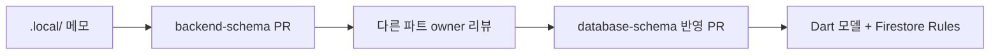

# 데이터베이스 스키마 — 팀 협업 가이드

> **팀원 안내:** DB 스키마 작업·리뷰에 참여하기 전 **이 문서부터** 읽어 주세요.

파트가 나뉜 팀에서 Firestore 스키마를 **같이** 정리할 때 쓰는 작업 순서다.  
스키마 내용(컬렉션·필드)은 이 문서에 적지 않는다. **누가, 어디에, 어떤 순서로** 쓰는지만 정한다.

관련 문서:

| 문서 | 역할 |
|------|------|
| [database-schema.md](./database-schema.md) | **팀 공식 SSOT** — 합의·확정된 스키마만 |
| [backend-schema.md](./backend-schema.md) | **초안·탐색** — 아이디어, 대안, TODO |
| `.local/*.md` | **개인 작업 메모** — gitignore, GitHub에 올리지 않음 |
| [data-models.md](../data-models.md) | 현재 앱 모델·SharedPreferences 구조 (마이그레이션 참고) |

---

## 문서 3층 구조

```
.local/                              →  조사·질문·실험 (개인)
docs/database/backend-schema.md      →  제안 PR (파트 owner)
docs/database/database-schema.md     →  확정 반영 (팀 합의 후)
```

- `.local/`에서 생각하고, `backend-schema.md`에서 제안하고, `database-schema.md`에만 **합의 완료**를 올린다.
- Slack·카톡에 스키마를 흩뿌리지 말고, **항상 PR 또는 `database-schema.md`로 귀결**시킨다.

---

## 파트별 소유권 (Owner)

한 사람이 DB 전체를 맡지 않는다. **도메인(기능 영역) 단위 owner**가 자기 컬렉션만 정의한다.

| Owner (예시) | 담당 영역 | 참고 문서 |
|--------------|-----------|-----------|
| Auth | Firebase Auth, `users/{uid}` 프로필 | [auth.md](../auth.md) |
| Quiz | `quizQuestions`, 세션·채점·씨앗 보상 | [quiz-energy.md](../quiz-energy.md) |
| News | `newsArticles`, 북마크 | [news.md](../news.md) |
| Shop | 상점, 햄스터 해금, `hamsters` | [features.md](../features.md) |

규칙:

- owner는 **자기 섹션만** `backend-schema.md`에 PR로 추가한다.
- 다른 사람 영역은 **리뷰만** 하고, 직접 수정하지 않는다.
- 경계가 애매한 필드는 아래 [접점 표](#접점-표-단일-소스-ssot)에서 SSOT를 먼저 정한다.

---

## 공통 규칙 — 한 번만 정하기

파트마다 따로 정하면 충돌한다. 아래는 **팀이 먼저 합의**하고 `database-schema.md` 맨 위 §0에만 적는다.  
각 파트 owner는 규칙을 복사하지 말고 **링크**만 한다.

| 항목 | 예시 (확정 전) |
|------|----------------|
| 문서 ID | 의미 있는 id (`q1`, `saving`) vs auto id |
| 날짜 필드명 | `createdAt`, `completedOn` 등 통일 |
| 타임스탬프 타입 | Firestore `Timestamp` vs `yyyy-MM-dd` 문자열 |
| 유저 데이터 위치 | `users/{uid}` vs 최상위 컬렉션 |
| 쓰기 권한 | 클라이언트 직접 vs Cloud Functions (에너지·씨앗 등) |

→ 확정되면 [database-schema.md](./database-schema.md) §0 공통 규칙에 반영한다.

---

## 작업 순서 (실무 흐름)



### 1. 조사·질문 → `.local/`

- 필요한 필드, API, 앱 코드 위치를 메모한다.
- `.local/`은 `.gitignore`에 포함되어 GitHub에 올라가지 않는다.
- 예: `.local/quiz-content.md` — 퀴즈 파트 범위·현재 앱 상태 정리

### 2. 제안 → `backend-schema.md` PR

- **작은 PR** — 파트당 1~2 컬렉션, 한 번에 스키마 전체 X
- 자기 owner 영역 섹션만 추가·수정
- PR 본문에 **영향 범위** 한 줄 (예: “news 탭 북마크 쿼리에 영향”)

### 3. 리뷰 → 다른 파트 owner

PR 리뷰 체크리스트:

- [ ] 다른 컬렉션과 **같은 uid·날짜 필드**를 쓰는가?
- [ ] `users/{uid}` 문서가 **1MB**를 넘을 가능성은 없는가? (기록은 서브컬렉션?)
- [ ] **Security Rules**로 읽기/쓰기를 막을 수 있는 구조인가?
- [ ] [data-models.md](../data-models.md) 기존 앱 모델과 **필드명이 호환**되는가?
- [ ] [접점 표](#접점-표-단일-소스-ssot)와 **쓰기 owner**가 일치하는가?

### 4. 확정 → `database-schema.md` PR

- 합의된 내용만 `database-schema.md`에 옮긴다.
- `backend-schema.md` 해당 부분에는 `→ database-schema §N 참고` 표시를 남긴다.
- **스키마를 한 번에 완성하지 않는다.** 파트마다 작은 PR을 여러 번 보낸다.

### 5. 코드 반영

- `lib/models/` Dart 모델
- (이후) Firestore Security Rules, Cloud Functions

---

## 접점 표 (단일 소스 SSOT)

파트가 다르면 **같은 데이터를 두 군데 정의**하기 쉽다. 필드 설계 전에 **누가 쓰고 누가 읽는지**만 정한다.

| 데이터 | 단일 소스 (SSOT) | 다른 파트 |
|--------|------------------|-----------|
| streak, energy | `users/{uid}` (퀴즈 제안 → Auth owner 승인) | 읽기만 |
| `categoryStats` | `users/{uid}` (Quiz owner) | 프로필 UI는 읽기 |
| `seeds` | 지급·차감 **쓰기 owner 하나** (Functions 권장) | 나머지는 읽기 |
| 퀴즈 정답 | `quizQuestions` (콘텐츠) + `sessions/answers` (기록) | 채점 로직 owner 명확히 |

표는 팀 합의 후 [database-schema.md](./database-schema.md)에도 반영한다.

---

## 커뮤니케이션

| 방식 | 용도 |
|------|------|
| **비동기** | GitHub PR, 이슈 (라벨: `schema/auth`, `schema/quiz` …) |
| **동기** | 주 1회 15~20분 — “이번 주 확정 / 보류 / 타 파트 영향”만 |
| **알림** | `database-schema.md` 변경 PR에 `@mention` + 영향 범위 한 줄 |

---

## `database-schema.md` 목차 (합의용)

스키마 **내용**은 아직 비워 둔다. 팀이 섹션 구조만 먼저 맞춘다.

| § | 섹션 | Owner (예시) |
|---|------|--------------|
| 0 | 공통 규칙 | 팀 전체 |
| 1 | Auth / Users | Auth |
| 2 | Quiz | Quiz |
| 3 | News | News |
| 4 | Shop / Hamster | Shop |
| 5 | 미정 (bookmarks, feedback …) | TBD |

---

## PR 라벨·제목 예시

```
schema/quiz     backend-schema: quizQuestions 필드 초안
schema/auth     database-schema: §1 users/{uid} 확정 반영
schema/convention  database-schema: §0 공통 규칙 추가
```

---

## 한 줄 요약

**`.local`은 실험, `backend-schema`는 제안, `database-schema`는 계약서.**  
파트 owner가 초안 PR → 공통 규칙·접점 리뷰 → `database-schema.md`에만 확정 반영.
