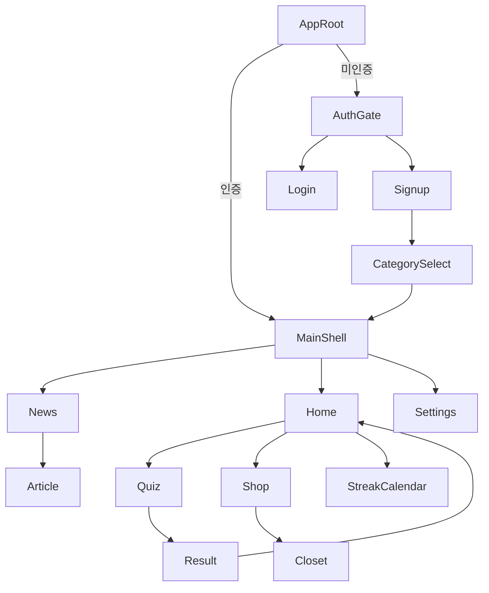

# 화면·네비게이션

## 인증 전

| 화면 | 파일 | 역할 |
|------|------|------|
| AuthGate | `lib/screens/auth/auth_gate.dart` | 세션 확인, 로그인↔회원가입 전환 |
| LoginScreen | `lib/screens/auth/login_screen.dart` | 로그인, 비밀번호 찾기 |
| SignupScreen | `lib/screens/auth/signup_screen.dart` | 가입 + 약관 동의 |
| FindPasswordScreen | `lib/screens/auth/find_password_screen.dart` | 비밀번호 재설정 |
| CategorySelectScreen | `lib/screens/auth/category_select_screen.dart` | 관심 카테고리 (가입 직후) |
| LegalDocumentScreen | `lib/screens/legal/legal_document_screen.dart` | 약관/개인정보 본문 |

AuthGate는 Navigator 없이 상태(`_showSignup`)로 로그인/회원가입을 바꿔, `onAuthenticated` 콜백이 끊기지 않게 한다.

## 인증 후 — MainShell

파일: `lib/screens/home/main_shell.dart`  
하단 네비: `lib/widgets/home_bottom_nav.dart`  
기본 탭: **홈 (index 1)**

| Index | 탭 | 화면 | 파일 |
|------:|----|------|------|
| 0 | 리스트 | 뉴스 | `lib/screens/news/news_screen.dart` |
| 1 | 홈 | 홈 | `lib/screens/home/home_screen.dart` |
| 2 | 프로필(점 3개) | 설정 | `lib/screens/settings/settings_screen.dart` |

`IndexedStack`으로 탭을 유지하고, 하단 `HomeBottomNav`는 항상 고정이다.

> `lib/screens/profile/profile_screen.dart`(햄스터 컬렉션 UI)는 현재 셸에 **연결되어 있지 않다**.

## 상점 흐름 (홈에서)

홈 상단 **해바라기씨 주머니** 아이콘을 누르면 상점 스택이 열린다.

```
HomeScreen
  → ShopScreen (아이템 상점, node `235:479`)
    → ClosetScreen (햄핀이 옷장, node `235:382`)
  → pop → HomeScreen 프로필(씨앗) 새로고침
```

| 화면 | 파일 |
|------|------|
| ShopScreen | `lib/screens/shop/shop_screen.dart` |
| ClosetScreen | `lib/screens/shop/closet_screen.dart` |

## 연속학습 캘린더 (홈에서)

홈 상단 **불꽃(연속학습)** 아이콘을 누르면 캘린더가 열린다. 친구 경쟁·출석 날짜는 프론트 목업이다.

```
HomeScreen
  → StreakCalendarScreen (node `235:53`)
```

| 화면 | 파일 |
|------|------|
| StreakCalendarScreen | `lib/screens/calendar/streak_calendar_screen.dart` |

## 퀴즈 흐름 (홈에서)

```
HomeScreen
  → QuizScreen (10문제)
  → QuizCompleteScreen (마지막 문제 제출 후, pushReplacement / 터치하면 넘어감)
  → QuizResultScreen (pushReplacement)
  → pop(true) → HomeScreen 프로필 새로고침
```

| 화면 | 파일 |
|------|------|
| QuizScreen | `lib/screens/quiz/quiz_screen.dart` |
| QuizCompleteScreen | `lib/screens/quiz/quiz_complete_screen.dart` |
| QuizResultScreen | `lib/screens/quiz/quiz_result_screen.dart` |

## 뉴스 → 기사

```
NewsScreen → ArticleScreen (WebView, 모바일)
           또는 url_launcher (미지원 플랫폼)
```

| 화면 | 파일 |
|------|------|
| ArticleScreen | `lib/screens/news/article_screen.dart` |

기사 하단(또는 배너) **「이 기사로 퀴즈 풀기」**는 `onStartQuiz` 콜백으로 열려 있으나, 뉴스에서 아직 넘기지 않는다. → [roadmap.md](./roadmap.md)

## 설정

설정 완료 → `onComplete` → 홈 탭(index 1)으로 이동.  
로그아웃 → `MainShell.onLogout` → `AppRoot`가 `AuthGate`로 전환.

## 흐름도


