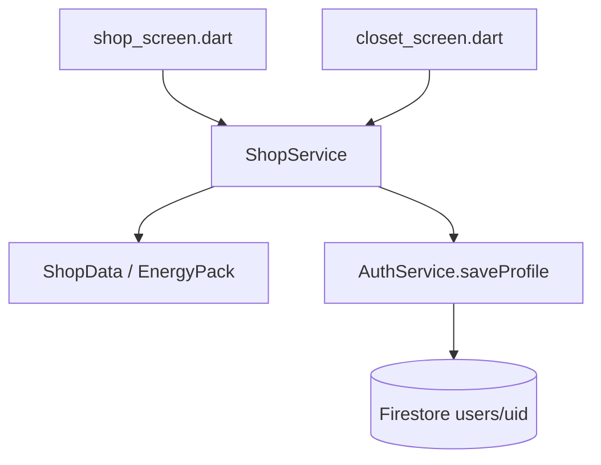

# 씨앗 상점 · 에너지 구매 (설계 초안)

관련 코드: `lib/data/shop_data.dart`, `lib/services/shop_catalog_service.dart`, `lib/services/quiz_service.dart`, `lib/services/auth_service.dart`, `lib/models/user_profile.dart`, `lib/screens/shop/`, `lib/widgets/shop/shop_widgets.dart`

관련 문서: [quiz-energy.md](./quiz-energy.md), [features.md](./features.md), [database/backend-schema.md](./database/backend-schema.md), [roadmap.md](./roadmap.md)

> 상태: 설계 초안. 아직 구현 전 — 이 문서 기준으로 `ShopService` 등을 새로 만든다.

---

## 배경 · 현재 상태

> 2026-09 갱신: 아래 표는 PR #37 리뷰([yang-co1](https://github.com/gayun829/hamfinz/pull/37#issuecomment-5558336548)) 이후 main 기준으로 다시 맞췄다. 방어권 씨앗 미차감 버그와 에너지 구매 부재는 이 문서 작성 이후 이미 다른 PR에서 부분 구현됐다.

| 항목 | 현재 상태 |
|------|-----------|
| `UserProfile.seeds` | ✅ 정답당 +5 (`QuizData.seedsPerCorrect`), `QuizService.completeSession`에서 적립 |
| `ShopData.items` / Firestore `shopItems` | ✅ 로컬 `ShopData.items` + `ShopCatalogService.getItemsOrFallback()`이 Firestore `shopItems`(활성 상품만)와 합쳐 쓰는 hybrid 구조. 단, **로컬에 이미 있는 id는 Firestore 값으로 덮어쓰지 않는다** — 로컬과 id가 겹치면 Firestore 쪽은 조용히 무시된다(`ShopCatalogService`가 `ignoredExisting`으로 디버그 로그만 남김). 즉 지금 카탈로그의 단일 진실 공급원은 여전히 로컬 `ShopData.items`다 |
| 방어권·에너지 구매 UI/로직 | ✅ `shop_screen.dart`의 `_buyStudyGuard`/`_buyEnergy`에 구현됨 (씨앗 차감 포함, 방어권 미차감 버그는 이미 고쳐짐) |
| `ShopService` (서비스 레이어) | ❌ 아직 없음. 구매·검증 로직이 `shop_screen.dart`(방어권·에너지)와 `closet_screen.dart`(`_onItemTap` → `_purchaseOrEquipFromPreview` → `_equipOrBuyItem`, 스킨/무늬/배경/악세서리)로 화면·메서드에 분산 |
| 에너지 팩 | ⚠️ `energy_pack` 1종(가격 123씨앗 → 에너지 +20)만 존재. 이 문서가 제안하는 소포장/한 세션/완전충전 다종 `EnergyPack` 타입은 아직 미도입 |
| Firestore `firestore.rules` | ⚠️ `shopItems`는 이미 읽기 공개·쓰기 금지로 등록돼 있음. 다만 `users/{uid}`는 여전히 `allow read, write: if request.auth.uid == uid` 전면 허용이라, 아래 "재화 조작 방지" 섹션이 설명하는 느슨함은 그대로 남아 있음 |

이번 설계의 목표는 다음 세 가지로 조정한다 (버그 수정은 이미 완료돼 목표에서 뺀다).

1. 스킨·무늬·배경·악세서리·연속학습방어권·에너지 구매 로직을 화면에서 서비스 레이어(`ShopService`) 한 곳으로 통합
2. 에너지 팩을 지금의 1종(`energy_pack`, +20)에서 소포장/한 세션/완전충전 다종 `EnergyPack`으로 확장
3. Firestore Rules 강화 (재화 조작 방지) — `shopItems` 컬렉션 자체는 이미 있으니 "신설"이 아니라 Rules가 참조하는 가격의 단일 진실 공급원으로 정리하는 작업

백엔드는 이 프로젝트의 다른 기능들과 동일하게 **클라이언트 Dart 서비스가 Firestore를 직접 읽고 쓰는 구조**를 기본으로 따른다 (`QuizService`, `AuthService`와 동일 패턴). 다만 참고로, 퀴즈 채점만큼은 이 문서 작성 이후 `functions/index.js`(`submitAnswer`/`completeSession` Callable)가 추가돼 `quiz_backend_config.dart` 설정으로 클라이언트 트랜잭션(`QuizSessionRepository`)과 전환해 쓸 수 있게 됐다 — 즉 "Cloud Functions는 이 저장소에 없다"는 더 이상 사실이 아니다. 상점 구매는 아직 이 전환 대상이 아니라 계속 클라이언트 Dart 서비스(`ShopService`) 구조로 가고, 이번 범위에서 상점용 Cloud Functions를 새로 만들지도 않는다.

---

## 구성



### 1. 데이터 레이어 — `lib/data/shop_data.dart`에 에너지 팩 추가

에너지는 소유·장착 개념이 없는 소모성 교환이라 기존 `ShopItem`과 분리한다.

```dart
class EnergyPack {
  const EnergyPack({
    required this.id,
    required this.seedsPrice,
    required this.energyAmount,
    required this.label,
  });

  final String id;
  final int seedsPrice;
  final int energyAmount;
  final String label;
}
```

예시 가격안 (상수라 나중에 조정만 하면 됨):

| id | seedsPrice | energyAmount | label |
|----|-----------:|--------------:|-------|
| `small` | 15 | 25 | 소포장 |
| `medium` | 25 | 50 | 한 세션 |
| `large` | 45 | 100 | 완전 충전 |

> 스코프 메모: 지금 `ShopData.items`에는 이미 `energy_pack`(123씨앗 → +20) 1종이 `ShopItem`으로 들어가 있다. 이번 설계는 "신규 기능 추가"가 아니라 **기존 1종을 `ShopItem`에서 떼어내 `EnergyPack` 타입으로 옮기고, 다종으로 확장**하는 리팩터에 가깝다. 구현 시 기존 `energy_pack` id를 그대로 쓸지, 위 3종 id로 교체하고 마이그레이션할지 정해야 한다.

### 2. 구매 결과 타입 (신규)

서비스가 실패 사유까지 리턴하고, 화면은 그 결과만 보고 스낵바 문구를 정한다. 씨앗 차감 여부 같은 로직이 화면에 다시 새어나가지 않게 하는 게 목적.

```dart
enum PurchaseStatus {
  success,
  insufficientSeeds,
  alreadyOwned,
  maxCapacityReached, // 방어권 3개 초과, 에너지 이미 가득
  notLoggedIn,
}

class ShopPurchaseResult {
  final PurchaseStatus status;
  final int seedsSpent;
  final UserProfile profile;
}
```

### 3. 서비스 레이어 — `lib/services/shop_service.dart` (신규)

`QuizService`와 같은 싱글턴 패턴. 씨앗이 관여하는 모든 구매를 여기로 모은다.

| 메서드 | 설명 |
|--------|------|
| `buyShopItems(profile, itemIds)` | 스킨/무늬/배경/악세서리 공용 구매. `closet_screen.dart`에 지금 흩어진 검증·구매·장착 흐름(`_onItemTap` → `_purchaseOrEquipFromPreview` → `_equipOrBuyItem`)을 이걸로 대체 |
| `buyStudyGuard(profile)` | 최대 보유(3개) 체크 + 가격은 `ShopData`의 `study_guard` 아이템 price 참조. `shop_screen.dart`의 `_buyStudyGuard`를 대체(이미 씨앗 차감은 되고 있으니 로직만 서비스로 이동) |
| `buyEnergyPack(profile, packId)` | `shop_screen.dart`의 `_buyEnergy`(1종, +20)를 대체하며 다종 팩을 지원. 씨앗 검증 → 차감 → `energy`를 `clamp(0, maxEnergy)`로 증가 → 저장 |

세 메서드 모두 "씨앗 검증 + 차감"을 내부 공통 private 헬퍼(예: `_trySpendSeeds`)로 묶어서 같은 종류의 버그 재발을 막는다. 저장은 기존과 동일하게 `AuthService.instance.saveProfile(profile)`을 재사용한다 — 단, `saveProfile`은 지금 `clientOwnedJson(profile)`(nickname/selectedHamsterId/interestCategories/**seeds**/**ownedShopItemIds**/**studyGuardCount**/equipped\*)만 `.update()`하는 partial merge이고, `energy`는 `saveProfile(profile, includeEnergy: true)`처럼 옵션을 켜야만 같이 써진다(그 외 streak/learningDates 등은 퀴즈 트랜잭션·Functions 전용이라 여기서 건드리면 안 됨). `buyEnergyPack`은 반드시 `includeEnergy: true`로 호출해야 한다. Firestore 스키마 변경은 없다 (`seeds`, `studyGuardCount`, `ownedShopItemIds`, `energy` 모두 `users/{uid}`에 이미 존재).

### 4. UI 연결 지점 (구현 시 손댈 파일)

| 파일 | 변경 내용 |
|------|-----------|
| `screens/shop/shop_screen.dart` | 방어권 구매를 `ShopService.buyStudyGuard`, 에너지 구매를 `ShopService.buyEnergyPack` 호출로 교체. 에너지 팩 카드를 다종으로 확장 |
| `screens/shop/closet_screen.dart` | `_onItemTap`/`_purchaseOrEquipFromPreview`/`_equipOrBuyItem`에 흩어진 구매 로직을 `ShopService.buyShopItems` 호출로 교체 |
| `widgets/shop/shop_widgets.dart` | 에너지 팩 카드 위젯 추가 시 기존 `ShopSeedChip` 등 재사용 |

---

## 아직 안 정한 것

- 에너지가 이미 가득 찬 상태에서 팩 구매를 막을지, 초과분을 버리고 허용할지 — 기본 제안은 **막기**(씨앗 낭비 방지, `maxCapacityReached` 리턴)
- 에너지 팩 최종 가격·수량 (위 표는 예시)
- 클라이언트가 `seeds`/`energy`를 직접 쓰는 구조라 이론상 조작 여지가 남음 — [backend-schema.md](./database/backend-schema.md)에 이미 명시된 known limitation과 동일. 필요해지면 추후 Cloud Functions로 이전 검토

## 재화 조작 방지 — 절충안: Rules만 먼저 좁힌다

> 결정: Cloud Functions는 Blaze(종량제) 요금제가 필수라(배포만 해도 소액 과금) 지금 당장은 도입하지 않는다. 대신 지금 배포된 `firestore.rules`가 필요 이상으로 느슨한 부분부터 좁힌다. Cloud Functions 전환은 나중에 다시 검토 (아래 "Rules로 못 막는 것" 참고).

### 지금 상태가 생각보다 더 느슨하다

실제 배포된 `firestore.rules`를 확인해보니, [backend-schema.md](./database/backend-schema.md) 초안에 있던 "energy/streak 등은 클라이언트가 못 건드리게" 하는 필드 제한이 **적용돼 있지 않다.**

```
match /users/{uid} {
  allow read, write: if request.auth != null && request.auth.uid == uid;
}
```

본인 문서면 필드 상관없이 통째로 덮어쓸 수 있는 상태라, `seeds`·`energy`·`ownedShopItemIds`·`studyGuardCount`를 원하는 값으로 그냥 바꿔치기할 수 있다. 최소한 이것부터 막는 게 이번 절충안의 목표.

### Rules만으로 막을 수 있는 것

- **가격표를 Rules가 참조할 단일 진실 공급원으로 정리한다.** `shopItems/{id}`는 이미 Firestore에 있다(읽기 공개·쓰기 금지 — `quizQuestions`와 동일 패턴). 다만 앱은 지금 hybrid(`ShopCatalogService.getItemsOrFallback()`)라 로컬 `ShopData.items`와 겹치는 id는 Firestore 값을 무시하므로, Rules가 믿을 수 있는 값이 되려면 이 hybrid를 정리해야 한다. `energyPacks/{id}`는 아직 없어서 신규로 만든다.
- **구매는 델타 검증으로 허용한다.** 예: 아이템 구매 시 `request.resource.data.seeds == resource.data.seeds - get(/databases/$(database)/documents/shopItems/$(itemId)).data.price` 이고, 그 아이템이 기존 `ownedShopItemIds`에 없었고, diff된 필드가 `seeds`·`ownedShopItemIds` 둘뿐인 경우에만 허용. 방어권·에너지팩 구매도 같은 패턴. 단, `AuthService.saveProfile`이 이미 `clientOwnedJson(profile)` 필드만 `.update()`하는 partial merge(에너지는 `includeEnergy: true`일 때만 포함)로 바뀌어 있으니, Rules의 "diff된 필드가 이것뿐" 조건을 이 partial update 모양에 맞춰 다시 확인해야 한다(§3 서비스 레이어 설명 참고).
- **필드별로 허용 범위를 분리한다.** `nickname`·`interestCategories`·`selectedHamsterId`·`equipped*`(소유 검증 포함)는 자유롭게, `seeds`·`energy`·`streak`·`studyGuardCount`·`ownedShopItemIds`는 위 구매/세션 경로로만 변경 허용 — 임의 값 지정은 거부.

### Rules로는 못 막는 것 (정직하게 남는 구멍)

- **퀴즈 채점은 이미 서버 경로가 생겼다 (상점 구매와는 별개).** 이 문서 작성 당시엔 "서버가 직접 채점하지 않는 한 근본적으로 못 막는다"고 썼지만, 이후 `functions/index.js`에 `submitAnswer`/`completeSession` Callable이 추가돼 `quiz_backend_config.dart` 설정으로 `QuizFunctionsRepository`(서버 채점) ↔ `QuizSessionRepository`(클라이언트 트랜잭션, 개발용)를 전환해 쓸 수 있다. 다만 **상점 구매(seeds/energy 차감)는 이 전환 대상이 아니라 여전히 클라이언트가 직접 씀** — 이 섹션이 다루는 구멍은 퀴즈 채점이 아니라 상점 재화 조작 쪽으로 범위를 좁혀 읽어야 한다.
- **완화책(부분적 차단만 가능):** 세션 1회당 최대 획득량 상한(예: +50씨앗, +100xp 초과 금지)과 세션 간 최소 간격 제한을 Rules에 넣어서, 조작을 막지는 못해도 "무한 반복으로 크게 불려서" 생기는 피해 규모는 줄인다.

### 작업 항목 (설계 — 구현 전)

1. `shopItems/{id}`는 이미 있으니 "신설"이 아니라 **Rules가 참조할 가격의 단일 진실 공급원으로 정리**한다 — 로컬 `ShopData.items`와 필드(특히 price)가 어긋나지 않는지 점검. `energyPacks/{id}`는 여전히 신규 컬렉션(읽기 공개, 쓰기 금지)이 필요
2. `shop_data.dart` → Firestore 완전 전환은 아직 안 끝났다. 지금 `ShopCatalogService.getItemsOrFallback()`은 **로컬에 없는 새 id만 Firestore에서 가져오고, 로컬과 겹치는 id는 무시**하는 hybrid라, Rules가 가격 위변조를 막으려면 이 hybrid 정책부터 "Firestore가 항상 우선" 또는 "로컬은 폐기하고 전부 Firestore" 중 하나로 정리해야 한다
3. `firestore.rules`의 `users/{uid}` 규칙을 필드별 read/write 세분화 + 구매 델타 검증으로 재작성
4. 세션 완료 시 seeds 증가량 상한 규칙 추가 (완화책)
5. 위 "Rules로는 못 막는 것"을 [backend-schema.md](./database/backend-schema.md)의 미정 사항에도 반영 — 나중에 Cloud Functions 도입을 다시 논의할 때 근거로 남긴다

## 관련 문서

- [quiz-energy.md](./quiz-energy.md) — 에너지 소모·회복 규칙
- [database/backend-schema.md](./database/backend-schema.md) — Firestore 스키마, Cloud Functions 권장 사항
- [roadmap.md](./roadmap.md)
