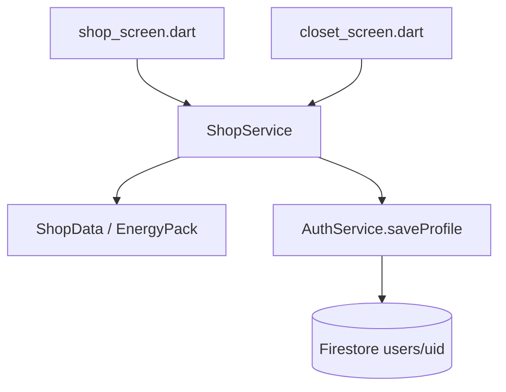

# 씨앗 상점 · 에너지 구매 (설계 초안)

관련 코드: `lib/data/shop_data.dart`, `lib/services/quiz_service.dart`, `lib/services/auth_service.dart`, `lib/models/user_profile.dart`, `lib/screens/shop/`, `lib/widgets/shop/shop_widgets.dart`

관련 문서: [quiz-energy.md](./quiz-energy.md), [features.md](./features.md), [database/backend-schema.md](./database/backend-schema.md), [roadmap.md](./roadmap.md)

> 상태: 설계 초안. 아직 구현 전 — 이 문서 기준으로 `ShopService` 등을 새로 만든다.

---

## 배경 · 현재 상태

씨앗(seed) 자체와 가격 데이터는 이미 존재한다.

| 항목 | 현재 상태 |
|------|-----------|
| `UserProfile.seeds` | ✅ 존재. 정답당 +5 (`QuizData.seedsPerCorrect`), `QuizService.completeSession`에서 적립 |
| `ShopData.items` 가격 | ✅ 존재. 스킨/무늬/악세서리/배경/연속학습방어권 모두 `price`(씨앗) 필드 있음 |
| 구매 로직 | ⚠️ 서비스 레이어 없이 화면(`StatefulWidget`)에 직접 들어있음 |
| 중복 | ⚠️ `closet_screen.dart`에 거의 같은 구매 로직이 두 곳(`_purchasePreview`, 구매 버튼 `onTap`)에 중복 |
| 버그 | 🐛 `shop_screen.dart`의 `_buyStudyGuard`가 `studyGuardCount`만 늘리고 **씨앗을 차감하지 않음** |
| 에너지 구매 | ❌ 기능 자체가 없음 (UI·로직 모두 없음) |

이번 설계의 목표는 세 가지다.

1. 스킨·무늬·배경·악세서리·연속학습방어권 구매 로직을 서비스 레이어 한 곳으로 통합
2. 씨앗으로 에너지를 사는 기능 신설
3. 위 버그(방어권 씨앗 미차감) 수정

백엔드는 이 프로젝트의 다른 기능들과 동일하게 **클라이언트 Dart 서비스가 Firestore를 직접 읽고 쓰는 구조**를 따른다 (`QuizService`, `AuthService`와 동일 패턴). Cloud Functions는 아직 이 저장소에 없고([backend-schema.md](./database/backend-schema.md) 참고, "권장"이지 구현된 상태는 아님), 이번 범위에서도 새로 만들지 않는다.

---

## 구성



### 1. 데이터 레이어 — `lib/data/shop_data.dart`에 에너지 팩 추가

에너지는 소유·장착 개념이 없는 소모성 교환이라 기존 `ShopItem`과 분리한다.

```dart
class EnergyPack {
  const EnergyPack({
    required this.id,
    required this.seedsPrice,
    required this.energyAmount,
    required this.label,
  });

  final String id;
  final int seedsPrice;
  final int energyAmount;
  final String label;
}
```

예시 가격안 (상수라 나중에 조정만 하면 됨):

| id | seedsPrice | energyAmount | label |
|----|-----------:|--------------:|-------|
| `small` | 15 | 25 | 소포장 |
| `medium` | 25 | 50 | 한 세션 |
| `large` | 45 | 100 | 완전 충전 |

### 2. 구매 결과 타입 (신규)

서비스가 실패 사유까지 리턴하고, 화면은 그 결과만 보고 스낵바 문구를 정한다. 씨앗 차감 여부 같은 로직이 화면에 다시 새어나가지 않게 하는 게 목적.

```dart
enum PurchaseStatus {
  success,
  insufficientSeeds,
  alreadyOwned,
  maxCapacityReached, // 방어권 3개 초과, 에너지 이미 가득
  notLoggedIn,
}

class ShopPurchaseResult {
  final PurchaseStatus status;
  final int seedsSpent;
  final UserProfile profile;
}
```

### 3. 서비스 레이어 — `lib/services/shop_service.dart` (신규)

`QuizService`와 같은 싱글턴 패턴. 씨앗이 관여하는 모든 구매를 여기로 모은다.

| 메서드 | 설명 |
|--------|------|
| `buyShopItems(profile, itemIds)` | 스킨/무늬/배경/악세서리 공용 구매. `closet_screen.dart`의 중복 로직 두 곳을 이걸로 대체 |
| `buyStudyGuard(profile)` | 최대 보유(3개) 체크 + 가격은 `ShopData`의 `study_guard` 아이템 price 참조. 기존 씨앗 미차감 버그가 여기서 고쳐짐 |
| `buyEnergyPack(profile, packId)` | 신규 기능. 씨앗 검증 → 차감 → `energy`를 `clamp(0, maxEnergy)`로 증가 → 저장 |

세 메서드 모두 "씨앗 검증 + 차감"을 내부 공통 private 헬퍼(예: `_trySpendSeeds`)로 묶어서 같은 종류의 버그 재발을 막는다. 저장은 기존과 동일하게 `AuthService.instance.saveProfile(profile)`을 그대로 재사용 — Firestore 스키마 변경은 없다 (`seeds`, `studyGuardCount`, `ownedShopItemIds`, `energy` 모두 `users/{uid}`에 이미 존재).

### 4. UI 연결 지점 (구현 시 손댈 파일)

| 파일 | 변경 내용 |
|------|-----------|
| `screens/shop/shop_screen.dart` | 방어권 구매를 `ShopService.buyStudyGuard` 호출로 교체. 에너지 팩 카드 섹션 신규 추가 |
| `screens/shop/closet_screen.dart` | 두 군데 구매 로직을 `ShopService.buyShopItems` 호출로 교체 |
| `widgets/shop/shop_widgets.dart` | 에너지 팩 카드 위젯 추가 시 기존 `ShopSeedChip` 등 재사용 |

---

## 아직 안 정한 것

- 에너지가 이미 가득 찬 상태에서 팩 구매를 막을지, 초과분을 버리고 허용할지 — 기본 제안은 **막기**(씨앗 낭비 방지, `maxCapacityReached` 리턴)
- 에너지 팩 최종 가격·수량 (위 표는 예시)
- 클라이언트가 `seeds`/`energy`를 직접 쓰는 구조라 이론상 조작 여지가 남음 — [backend-schema.md](./database/backend-schema.md)에 이미 명시된 known limitation과 동일. 필요해지면 추후 Cloud Functions로 이전 검토

## 재화 조작 방지 — 절충안: Rules만 먼저 좁힌다

> 결정: Cloud Functions는 Blaze(종량제) 요금제가 필수라(배포만 해도 소액 과금) 지금 당장은 도입하지 않는다. 대신 지금 배포된 `firestore.rules`가 필요 이상으로 느슨한 부분부터 좁힌다. Cloud Functions 전환은 나중에 다시 검토 (아래 "Rules로 못 막는 것" 참고).

### 지금 상태가 생각보다 더 느슨하다

실제 배포된 `firestore.rules`를 확인해보니, [backend-schema.md](./database/backend-schema.md) 초안에 있던 "xp/energy/streak 등은 클라이언트가 못 건드리게" 하는 필드 제한이 **적용돼 있지 않다.**

```
match /users/{uid} {
  allow read, write: if request.auth != null && request.auth.uid == uid;
}
```

본인 문서면 필드 상관없이 통째로 덮어쓸 수 있는 상태라, `seeds`·`energy`·`ownedShopItemIds`·`studyGuardCount`를 원하는 값으로 그냥 바꿔치기할 수 있다. 최소한 이것부터 막는 게 이번 절충안의 목표.

### Rules만으로 막을 수 있는 것

- **가격표를 Firestore로 옮긴다.** `lib/data/shop_data.dart`에 하드코딩된 카탈로그를 `shopItems/{id}`, `energyPacks/{id}` 마스터 컬렉션으로 옮긴다 (읽기 공개·쓰기 금지 — `quizQuestions`와 동일 패턴). Rules가 참조할 "가격의 단일 진실 공급원"이 앱 코드 안에만 있으면 검증이 불가능하기 때문.
- **구매는 델타 검증으로 허용한다.** 예: 아이템 구매 시 `request.resource.data.seeds == resource.data.seeds - get(/databases/$(database)/documents/shopItems/$(itemId)).data.price` 이고, 그 아이템이 기존 `ownedShopItemIds`에 없었고, diff된 필드가 `seeds`·`ownedShopItemIds` 둘뿐인 경우에만 허용. 방어권·에너지팩 구매도 같은 패턴.
- **필드별로 허용 범위를 분리한다.** `nickname`·`interestCategories`·`selectedHamsterId`·`equipped*`(소유 검증 포함)는 자유롭게, `seeds`·`energy`·`xp`·`streak`·`studyGuardCount`·`ownedShopItemIds`·`unlockedHamsterIds`는 위 구매/세션 경로로만 변경 허용 — 임의 값 지정은 거부.

### Rules로는 못 막는 것 (정직하게 남는 구멍)

- **퀴즈 채점 자체는 검증 불가능.** `quizQuestions/{id}`를 클라이언트가 읽을 수 있어서 `correctIndex`(정답)가 이미 노출돼 있다. 즉 "이 세션에서 몇 문제 맞혔다"는 클라이언트가 신고하는 값이고, Rules는 그 신고의 진위를 확인할 방법이 없다. 이건 서버(Cloud Functions)가 직접 채점하지 않는 한 근본적으로 못 막는다.
- **완화책(부분적 차단만 가능):** 세션 1회당 최대 획득량 상한(예: +50씨앗, +100xp 초과 금지)과 세션 간 최소 간격 제한을 Rules에 넣어서, 조작을 막지는 못해도 "무한 반복으로 크게 불려서" 생기는 피해 규모는 줄인다.

### 작업 항목 (설계 — 구현 전)

1. `shopItems/{id}`, `energyPacks/{id}` 마스터 컬렉션 신설 (읽기 공개, 쓰기 금지)
2. `shop_data.dart` 카탈로그를 이 컬렉션에서 읽어오도록 전환 (지금처럼 앱에만 박아두면 Rules가 참조할 데이터가 없음)
3. `firestore.rules`의 `users/{uid}` 규칙을 필드별 read/write 세분화 + 구매 델타 검증으로 재작성
4. 세션 완료 시 seeds/xp 증가량 상한 규칙 추가 (완화책)
5. 위 "Rules로는 못 막는 것"을 [backend-schema.md](./database/backend-schema.md)의 미정 사항에도 반영 — 나중에 Cloud Functions 도입을 다시 논의할 때 근거로 남긴다

## 관련 문서

- [quiz-energy.md](./quiz-energy.md) — 에너지 소모·회복 규칙
- [database/backend-schema.md](./database/backend-schema.md) — Firestore 스키마, Cloud Functions 권장 사항
- [roadmap.md](./roadmap.md)
